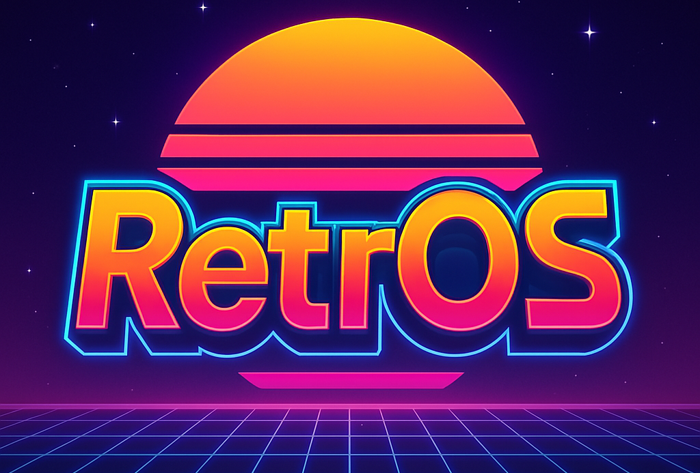

# RetrOS – Custom Firmware for Clone R36S (rk3326 Variant)

Welcome to **RetrOS** – a clean, stable custom firmware for clone R36S handhelds powered by the RK3326 SoC. RetrOS is purpose-built to boot from TF1, restoring and enhancing factory behavior with modern tweaks, deeper hardware support, and full image portability.

---

## 🚀 What’s Inside RetrOS

RetrOS is based on a hybrid build from factory NAND firmware, fused with stable bootloader components from ArkOS. It combines:

- ✅ **MBR** from K36 Clean — ensuring reliable boots on any card size
- ✅ **Custom kernel + DTB** for R36S (rk3536 variant) with correct analog stick mapping
- ✅ **Direct NAND extraction** of factory system partition
- ✅ **Fixed splash screen support** (logo_kernel + system splash)
- ✅ **Support for USB, WiFi (depending on module), and SSH**
- ✅ **Optional terminal access via EmulationStation "Options" menu**
- ✅ **Re-enabled EmulationStation features** like *Collections*, *Ports*, and *Netplay*

---

## 🔧 Technical Overview

- **Boot**: Clean `extlinux.conf`-based U-Boot setup with optional UUID or device path booting (`/dev/mmcblk1pX`)
- **Kernel**: Pulled from NAND image for perfect analog stick support; later builds will include modular kernel support
- **DTB**: Uses `rf3536k3ka.dtb`, which fixes analog direction and input registration
- **System**: Based on clean EmuELEC 4.x series with modified init and terminal utilities
- **Splash**: Boots with `logo_kernel.bmp` and optional `plymouth`-like splash image (neon gamepad design included)

---

## 📦 Files in This Repo

- `RetrOS-hybrid.img` – Final bootable image (TF1-bootable)
- `media/retros.png` – RetrOS splash/branding art
- `extlinux.conf` – Reference config
- `boot_partition.img` – Just the FAT32 partition for manual patching
- `rf3536k3ka.dtb` – Device tree blob for R36S

---

## 🛠 Use Cases

- 🧪 **Reverse engineering**: Full NAND mirror used for analysis
- 💾 **System restoration**: Reflashable image with correct bootloader
- 🎮 **Custom OS base**: Great for modders and retro gaming OS devs
- 💡 **Reference firmware**: Use RetrOS as a clean baseline for custom EmuELEC builds

---

## ⚠️ Known Issues

- ⏱️ Boot is slightly slower (~30s) using factory kernel; WIP kernel builds may improve this
- 🔌 WiFi support depends on compatible USB dongle or onboard chip (not all are supported)
- 🛠️ Recovery tools are not included by default; mount the STORAGE partition externally to debug

---

## 🧠 Coming Soon

- Automatic resizer for STORAGE on first boot
- Built-in busybox terminal launcher (for low-level debugging)
- Optional RetroArch core updater integration
- RetrOS OTA build script for kernel patching + image generation

---

## 📂 Credits

- EmuELEC community
- ArkOS for bootloader base
- RetrOS contributors for tooling, splash graphics, and testing
